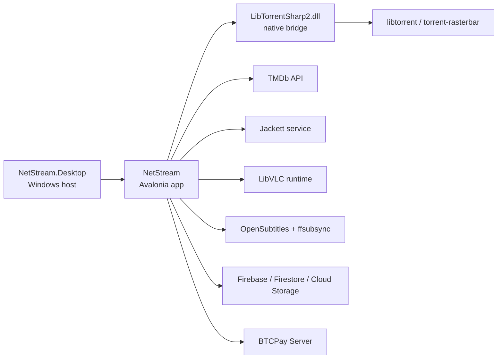

# NetStream

NetStream is a Windows-first media client built as a three-layer stack: a vendored `libtorrent` source tree, a native C++ bridge that exposes torrent operations to .NET, and an Avalonia desktop application that handles the rest of the product story: discovery, playback, subtitles, authentication, comments, watch history, and subscription payments.

This repository is set up as a monorepo on purpose. The torrent engine, the native interop layer, and the desktop application move together often enough that keeping them in one place makes day-to-day work a lot simpler.

## What lives here

At the top level, the repository is split into three main code areas and one runtime payload folder:

| Path | Role | Why it exists |
| --- | --- | --- |
| `libtorrent/` | Vendored torrent engine source | Native torrent functionality is built against this tree. |
| `LibTorrentSharp2/` | C++ shared library | Wraps `libtorrent` and exposes a C-style API that the .NET app can P/Invoke. |
| `NetStream/` | .NET solution folder | Contains the Avalonia shared app and the Windows desktop host. |
| `copy these to build output/` | Runtime helpers | Tools and payloads that must end up next to the app at build/publish time. |

Inside the solution folder, the layout is:

```text
NetStream/
  Directory.Packages.props
  NetStream.sln
  NetStream/
  NetStream.Desktop/
```

- `NetStream/NetStream/` is the shared Avalonia application.
- `NetStream/NetStream.Desktop/` is the Windows desktop entry point.
- `NetStream/Directory.Packages.props` manages NuGet package versions centrally.

## The architecture in one picture


```mermaid
graph LR
    A["NetStream.Desktop<br/>Windows host"] --> B["NetStream<br/>Avalonia app"]
    B --> C["LibTorrentSharp2.dll<br/>native bridge"]
    C --> D["libtorrent / torrent-rasterbar"]
    B --> E["TMDb API"]
    B --> F["Jackett service"]
    B --> G["LibVLC runtime"]
    B --> H["OpenSubtitles + ffsubsync"]
    B --> I["Firebase / Firestore / Cloud Storage"]
    B --> J["BTCPay Server"]
```

If you want the short version, this is the runtime chain:

1. The desktop host boots Avalonia and starts the shared application layer.
2. The shared app loads secrets from `.env`, prepares local folders, and initializes media playback.
3. Jackett is installed or started if needed.
4. Metadata, subtitles, account services, and billing services come online.
5. The UI either resumes the user session or drops into sign-in/sign-up.
6. Torrent selection and playback flow through the native wrapper and the media toolchain.

## How the app actually works

NetStream is not just a UI on top of a torrent library. The app stitches together several subsystems that each own a different part of the experience.

### Discovery and metadata

Movie and TV discovery runs through TMDb. The shared app creates a `TMDbClient` at startup and uses it for search, popular lists, episode details, images, and language-aware metadata.

### Torrent search and indexing

Jackett is used as the indexer layer. On startup, the desktop app checks whether Jackett is installed, seeds the config files under `%ProgramData%\Jackett`, and starts the service if necessary. Once Jackett is running, the app loads indexers and uses them to resolve torrents for movies and episodes.

### Torrent engine and native interop

The actual torrent engine is `libtorrent`, but the Avalonia app does not talk to it directly. Instead, the .NET side calls into `LibTorrentSharp2.dll`, a native wrapper that exposes torrent handles, status, files, priorities, piece ranges, pause/resume, and sequential download behavior through a P/Invoke-friendly boundary.

This split matters because it keeps the Avalonia app in C# while still letting the project use a mature native torrent engine underneath.

### Playback

Playback is built around LibVLC. The desktop app initializes the native VLC runtime from the build output and uses `LibVLCSharp` for media playback inside the Avalonia UI.

### Subtitles

Subtitles are handled through OpenSubtitles and local helper tools. The app supports a primary OpenSubtitles key and a pool of fallback keys, which is useful when you are working around rate limits. The runtime payload can also include tools such as `ffsubsync_wrapper.exe` for subtitle alignment workflows.

### Accounts, comments, storage, and watch history

Account and cloud-backed features run through Firebase and Google Cloud services:

- Firebase Auth is used for sign-in, sign-up, password flows, and email verification.
- Firestore stores user data, comments, watch history, and account-related records.
- Google Cloud Storage is used for profile photos and related assets.

### Payments

Billing is wired to BTCPay Server. The app initializes a BTCPay client during startup and uses it to create invoices and check payment state for subscription plans.

## Startup flow

The launch path is straightforward once you know where to look:

1. `NetStream.Desktop/Program.cs` starts Avalonia, registers the icon provider, and keeps Native AOT metadata alive for TMDb types.
2. `NetStream/App.axaml.cs` loads `.env`, initializes LibVLC, prepares directories and settings, applies language and theme defaults, and opens the splash screen.
3. The app installs or starts Jackett, initializes subtitle services, and loads metadata configuration.
4. Firebase and BTCPay are initialized.
5. The app decides whether to restore a signed-in session or show account flows.

That startup sequence is worth understanding because most "it launches but feature X is broken" problems come from one of those layers not being available yet.

## Repository map

Here is the practical map most contributors end up using:

```text
.
|- libtorrent/                         # native torrent source tree
|- LibTorrentSharp2/                   # C++ wrapper + native build files
|  |- CMakeLists.txt
|  |- LibTorrentSharp2.sln
|  |- LibTorrentSharp2/
|  `- x64/
|- NetStream/
|  |- Directory.Packages.props         # central NuGet versions
|  |- NetStream.sln
|  |- NetStream/                       # shared Avalonia app
|  |  |- Assets/
|  |  |- Controls/
|  |  |- Language/
|  |  |- Models/
|  |  |- Services/
|  |  |- SubtitleDownloader/
|  |  |- ViewModels/
|  |  `- Views/
|  `- NetStream.Desktop/               # Windows host
|- copy these to build output/         # helper binaries copied into output
|- .env.example
`- .gitignore
```

## Prerequisites

If you want a clean build on Windows, this is the stack to have ready:

- Windows 10 or Windows 11 x64
- .NET 9 SDK
- Visual Studio 2022 or the Visual C++ build tools with the `v143` toolset
- CMake 3.18 or newer if you want to build the native layer through CMake
- Boost 1.87 headers and libraries if you are rebuilding `LibTorrentSharp2`
- A working `libtorrent` source tree under this repository
- A populated `.env` file for external services

Two practical notes before you lose time chasing build errors:

- The checked-in Visual Studio project for `LibTorrentSharp2` currently uses hardcoded include/library paths for Boost. If your machine uses different paths, update the project or build through CMake with explicit arguments.
- The checked-in `CMakeLists.txt` should not be trusted blindly for path discovery. Pass `LIBTORRENT_ROOT` and `BOOST_ROOT` explicitly when you use it.

## Environment configuration

Secrets no longer live in source code. The app loads them from a local `.env` file and the repository already ignores that file.

Start by copying `.env.example` to `.env`, then fill in the values you actually use.

```env
NETSTREAM_JACKET_API_URL=
NETSTREAM_JACKET_API_KEY=
NETSTREAM_TMDB_API_KEY=
NETSTREAM_FIREBASE_AUTH_API_KEY=
NETSTREAM_FIREBASE_SERVICE_ACCOUNT_JSON_BASE64=
NETSTREAM_BTCPAY_URL=
NETSTREAM_BTCPAY_API_KEY=
NETSTREAM_BTCPAY_STORE_ID=
NETSTREAM_OPENSUBTITLES_API_KEY=
NETSTREAM_OPENSUBTITLES_API_KEYS=
```

The environment loader walks upward from the current working directory and the application base directory until it finds a `.env` file, so the normal repository-root setup works fine for local development.

### What each variable is for

| Variable | Used by | Notes |
| --- | --- | --- |
| `NETSTREAM_JACKET_API_URL` | Jackett integration | Usually `http://127.0.0.1:9117/` unless you run Jackett elsewhere. |
| `NETSTREAM_JACKET_API_KEY` | Jackett integration | Used when the app talks to the local or remote Jackett instance. |
| `NETSTREAM_TMDB_API_KEY` | TMDb client | Required for discovery and metadata. |
| `NETSTREAM_FIREBASE_AUTH_API_KEY` | Firebase Auth | Required for sign-in, sign-up, and email flows. |
| `NETSTREAM_FIREBASE_SERVICE_ACCOUNT_JSON_BASE64` | Firestore and Cloud Storage | Store the entire service account JSON as base64. |
| `NETSTREAM_BTCPAY_URL` | BTCPay | Required for invoice creation. |
| `NETSTREAM_BTCPAY_API_KEY` | BTCPay | API key for the configured store. |
| `NETSTREAM_BTCPAY_STORE_ID` | BTCPay | Store identifier used for invoice operations. |
| `NETSTREAM_OPENSUBTITLES_API_KEY` | Subtitle service | Primary OpenSubtitles key. |
| `NETSTREAM_OPENSUBTITLES_API_KEYS` | Subtitle service | Optional fallback key pool, separated by commas, semicolons, or new lines. |

For Firebase, the service account is intentionally stored as base64 rather than raw JSON because it keeps the `.env` file easier to parse and transport.

## Building the native layer

The desktop app expects to find the native bridge at:

```text
LibTorrentSharp2\x64\Release\LibTorrentSharp2.dll
```

Because of that, the least-friction path on Windows is to build the checked-in Visual Studio project in `Release|x64`.

### Option A: build with MSBuild

Run this from the repository root in a Developer PowerShell or Developer Command Prompt:

```powershell
msbuild .\LibTorrentSharp2\LibTorrentSharp2.sln /p:Configuration=Release /p:Platform=x64
```

If that completes successfully, the desktop project will copy `LibTorrentSharp2.dll` from the expected output folder automatically.

### Option B: build with CMake

If you prefer CMake, pass your paths explicitly:

```powershell
cmake -S .\LibTorrentSharp2 -B .\LibTorrentSharp2\build `
  -DLIBTORRENT_ROOT="C:\Users\Cumhur\Desktop\NetStream\libtorrent\libtorrent" `
  -DBOOST_ROOT="C:\Libraries\boost_1_87_0"

cmake --build .\LibTorrentSharp2\build --config Release
```

After a CMake build, make sure the resulting `LibTorrentSharp2.dll` ends up in `LibTorrentSharp2\x64\Release\` or adjust the desktop project to copy it from your actual output path.

## Building the desktop app

The managed solution is under `NetStream/NetStream.sln`.

### Restore and build

```powershell
dotnet restore .\NetStream\NetStream.sln
dotnet build .\NetStream\NetStream.Desktop\NetStream.Desktop.csproj -c Debug
```

### Run locally

```powershell
dotnet run --project .\NetStream\NetStream.Desktop\NetStream.Desktop.csproj -c Debug
```

### Publish a release build

`NetStream.Desktop` is already configured as a self-contained `win-x64` publish target with Native AOT enabled, so a normal publish command looks like this:

```powershell
dotnet publish .\NetStream\NetStream.Desktop\NetStream.Desktop.csproj -c Release -r win-x64
```

The main desktop output is typically under:

```text
NetStream\NetStream.Desktop\bin\<Configuration>\net9.0\win-x64\
```

The publish output will sit under the corresponding `publish\` folder beneath that tree.

## Runtime payload copied on every build

Everything placed under `copy these to build output/` is now copied into the desktop build output and publish output automatically with `PreserveNewest`.

That folder is where runtime helpers belong, for example:

- `Jackett.Installer.Windows.exe`
- `JacketConfig\...`
- `ffmpeg\...`
- `ffsubsync_wrapper.exe`
- `yt-dlp.exe`
- `torrent-rasterbar.dll`

In practice, that means you can keep the app's helper executables and runtime binaries in one place and let the desktop project mirror them into the final output folder.

This is especially useful when a feature depends on an external executable rather than a NuGet package.

## Local data and runtime paths

On first run, the app prepares a local working area under:

```text
%APPDATA%\NetStream
```

That directory is used for things like:

- `appSettings.json`
- `Torrents/`
- `Movies/`
- `Subtitles/`
- `Youtube/`
- `thumbnailCaches.json`
- `indexers.json`
- `downloadingTorrent.json`

Jackett configuration is copied into:

```text
%ProgramData%\Jackett
```

That split is intentional: user-specific app data lives under `%APPDATA%`, while the local Jackett service configuration lives under `%ProgramData%`.

## Important implementation notes

There are a few design choices in this repo that are easy to miss if you only skim the code.

### Central package management

NuGet versions are controlled from `NetStream/Directory.Packages.props`. If you are upgrading Avalonia, LibVLCSharp, Firebase packages, or anything else in the managed stack, that is the first file to touch.

### Native AOT publish

The desktop host is set up for self-contained `win-x64` publishing with Native AOT turned on. The project already includes some compatibility decisions for that setup, including explicit TMDb metadata preservation and partial trimming.

### Desktop-first reality

The shared project contains code paths and references for other platforms, but the checked-in solution and host project in this repository are centered on the Windows desktop build. If you are trying to treat this repo as a polished cross-platform release target today, you will end up doing extra integration work.

### Secrets stay out of source

Sensitive values are loaded from `.env`, and the old "put service keys directly in code or assets" approach should stay gone. If you add a new external service, wire it through `.env` and document it in `.env.example`.

## Troubleshooting

If the app builds but does not behave properly, these are the first places worth checking.

### Missing `.env` values

Some services can fail softly, but others are required. TMDb, Firebase, and BTCPay initialization depend on the environment values being present. Missing keys usually show up as startup exceptions or features that quietly never initialize.

### Missing native torrent bridge

If `LibTorrentSharp2.dll` is not present in the desktop output, torrent operations will fail at runtime. Build the native layer first and make sure the DLL is copied into the expected location.

### Missing helper binaries

If subtitle syncing, Jackett installation, download helpers, or media conversion features are not working, check whether the expected files actually made it into the build output. The application assumes those helpers are available next to the executable once the desktop project has copied them over.

### Existing warnings

The project can still emit existing compiler and package warnings depending on the machine and restore state. Treat that as maintenance debt rather than a sign that the basic repository structure is wrong.

## Before you push this repo to GitHub

There are a few practical housekeeping rules worth following before this becomes a public or semi-public repository:

- Keep `.env` local. Only commit `.env.example`.
- Do not commit `bin/`, `obj/`, `.vs/`, publish output, or other generated artifacts.
- Be careful with very large runtime binaries, especially full FFmpeg payloads. They are better handled through release assets, an external download step, or Git LFS than regular git history.
- Check third-party redistribution terms before shipping bundled tools such as FFmpeg, yt-dlp, Jackett, LibVLC, or other native dependencies in your releases.

## Suggested developer workflow

If you are working on this repo day to day, the smoothest loop usually looks like this:

1. Fill in `.env`.
2. Build `LibTorrentSharp2` in `Release|x64`.
3. Make sure `copy these to build output/` contains the helper binaries you expect.
4. Build or run `NetStream.Desktop`.
5. Verify the desktop output folder contains the native DLL, VLC payload, and helper tools.

That order saves a lot of time because it lines up with the real dependency chain of the application instead of the idealized one.

## Final note

NetStream is a fairly ambitious desktop application. It is doing UI work, native interop, torrent orchestration, local media playback, subtitle tooling, cloud-backed account features, and payment integration in one codebase. Once you understand that split, the repository stops looking chaotic and starts looking like what it really is: a product with several moving parts that just happen to ship together.
