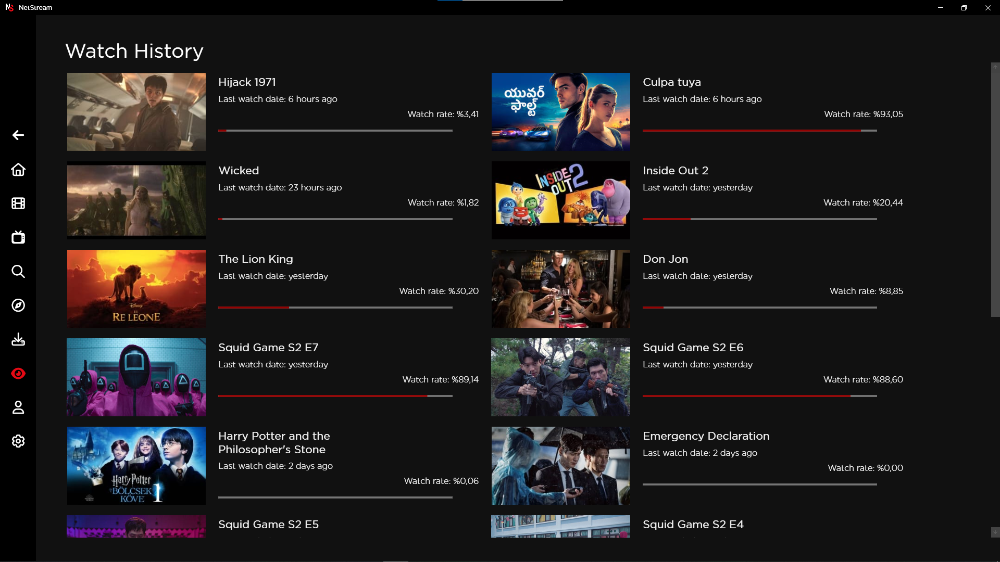

# NetStream: Your Ultimate Entertainment Experience

[YouTube](https://youtu.be/LenFUpJPwSc)

NetStream is your all-in-one destination for movies and TV shows, offering an unparalleled streaming and discovery experience. With advanced features and a user-friendly design, NetStream brings the world of entertainment to your fingertips like never before.

## 🌟 Explore a Universe of Content

- **Popular Movies & TV Shows:** Dive into trending content that everyone is talking about.
- **Top-Rated Gems:** Discover the highest-rated movies and series, handpicked for quality and entertainment.
- **Now Playing:** Stay up to date with the latest releases currently in theaters or airing on TV.

## 🔍 Advanced Search & Discovery

- **Search Anything:** Find movies, TV shows, actors, and directors with ease using our powerful search engine.
- **Smart Discovery with "Explore":** Choose your preferred content type (Movie or TV Show) and browse endless results tailored to your preferences.
  - **Sort by Popularity, Rating, Release Date, or Name.**
  - **Filter Results with Precision:**
    - By date range, genre, language, user ratings, votes, runtime, and more.
    - Minimum user ratings? Check. Favorite genres? Covered.

## 📂 Track Your Journey

- **Downloads Page:** Keep all your downloaded content organized and accessible.
- **Watch History:** Never lose track of what you’ve watched with our detailed history feature.

## ❤️ Personalize Your Experience

- **TMDb Integration:**
  - Rate movies and TV shows directly through your TMDb account.
  - Save your favorite titles or create custom watchlists.
- **Multi-Language Support:**
  - Program available in **44 languages** for global accessibility.
  - Subtitles in **86 languages** for immersive viewing.
  - TMDb content in **187 languages** to ensure a tailored experience.

## 🎥 In-Depth Content Details

- **Detailed Movie & TV Show Pages:**
  - Cast information and similar titles for endless recommendations.
  - See everything at a glance: release date, director, revenue, status, production companies, runtime, budget, language, videos, links, photos, comments, and torrents.
  - Add your own reviews and share your thoughts with the community.

- **Actor Profiles:**
  - Dive into comprehensive biographies, filmographies, photos, and external links for your favorite stars.

## 🚀 Why NetStream?
NetStream isn't just a streaming platform; it's a complete entertainment companion. Whether you're hunting for a blockbuster, diving into niche indie films, or exploring the latest binge-worthy series, NetStream ensures you'll always find something extraordinary.

🌍 **Your Gateway to the World of Entertainment—NetStream.**  
Start exploring today and redefine the way you enjoy movies and TV shows!

## 💳 Subscription Plans

To unlock the full potential of NetStream, choose from one of our flexible subscription plans that suit your needs:

- **7 Days Trial:** Experience everything for free!  
- **30 Days** – **$4.99:** Get access to all features for 1 month.  
- **90 Days** – **$13.99:** Enjoy 3 months of uninterrupted streaming.  
- **180 Days** – **$24.99:** Half a year of ultimate entertainment.  
- **360 Days** – **$44.99:** Full year of endless content.  
- **Lifetime Access** – **$299.99:** One-time payment for lifetime access to all features and future updates.

**Get started today and enjoy NetStream with the plan that fits you best!**
